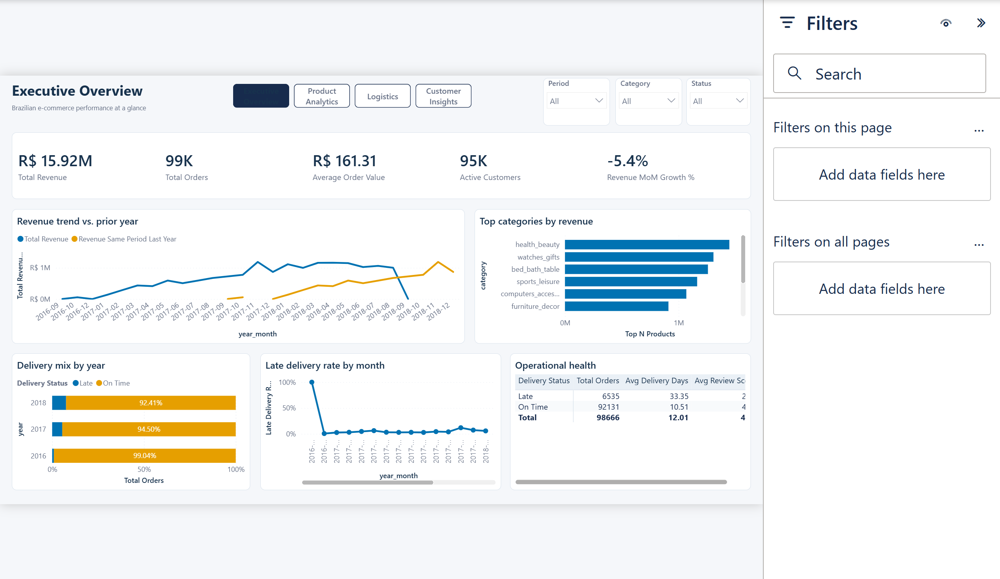
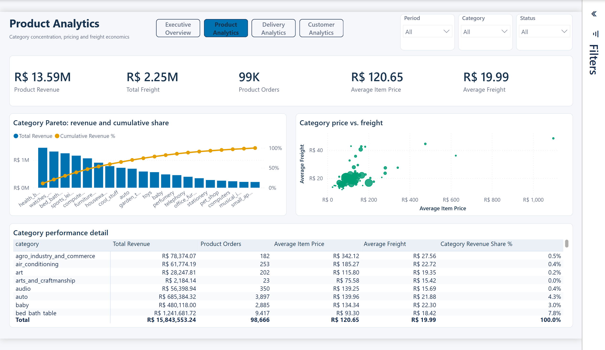
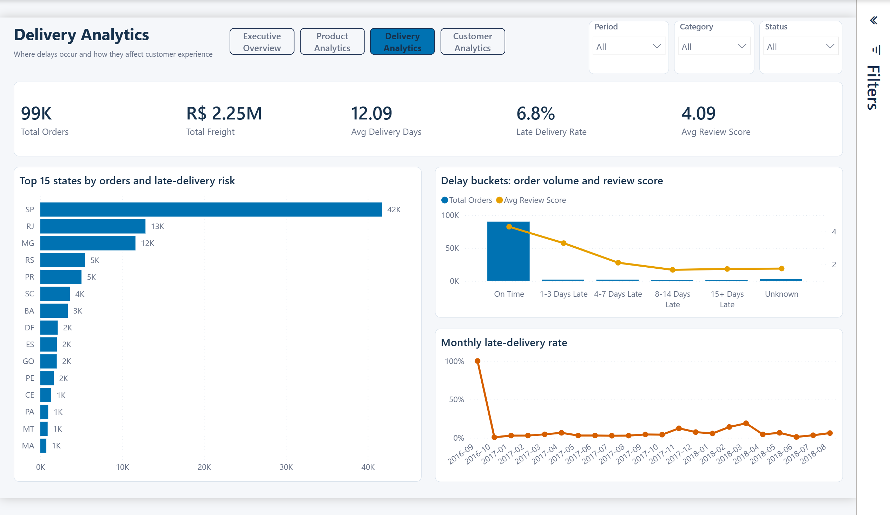
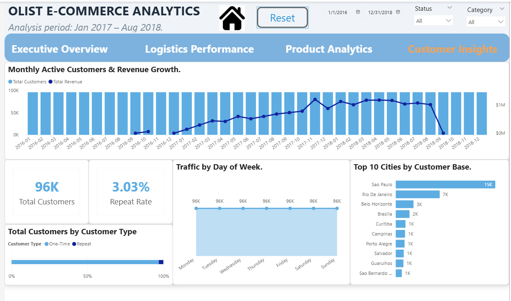

# Brazilian E-Commerce Analytics — End-to-End Data Pipeline

> An end-to-end data analytics portfolio project analyzing **100K+ real transactions** from the [Olist Brazilian E-Commerce dataset](https://www.kaggle.com/datasets/olistbr/brazilian-ecommerce). Covers the full lifecycle: Data Cleaning → SQL Analysis → Star Schema Modeling → Power BI Dashboard.


---

## Table of Contents

- [Project Overview](#-project-overview)
- [Dataset](#-dataset)
- [Project Architecture](#-project-architecture)
- [Phase 1: Data Profiling &amp; Cleaning](#-phase-1-data-profiling--cleaning)
- [Phase 2: SQL Business Analytics](#-phase-2-sql-business-analytics)
- [Phase 3: Star Schema Modeling](#-phase-3-star-schema-modeling)
- [Phase 4: Power BI Dashboard](#-phase-4-power-bi-dashboard)
- [Key Business Insights](#-key-business-insights)
- [Tech Stack](#-tech-stack)
- [How to Reproduce](#-how-to-reproduce)
- [Project Structure](#-project-structure)

---

## Project Overview

This project demonstrates a **production-grade data analytics pipeline** built from scratch, designed to answer critical business questions for an e-commerce marketplace:

| Business Question                                | Analysis Method                           |
| ------------------------------------------------ | ----------------------------------------- |
| Who are the most valuable customers?             | Customer Lifetime Value (CLV) & Retention |
| How does delivery speed affect satisfaction?     | Logistics-Review Correlation              |
| Which products drive 80% of revenue?             | Pareto (80/20) Analysis                   |
| How to segment customers for targeted marketing? | RFM Segmentation (8 segments)             |

**Target Audience:** Hiring managers & technical interviewers for Data Analyst (Intern/Junior) positions.

---

## Dataset

**Source:** [Olist Brazilian E-Commerce Public Dataset (Kaggle)](https://www.kaggle.com/datasets/olistbr/brazilian-ecommerce)

| Metric            | Value               |
| ----------------- | ------------------- |
| Total Orders      | ~99,000             |
| Total Order Items | ~113,000            |
| Unique Customers  | ~96,000             |
| Unique Products   | ~33,000             |
| Unique Sellers    | ~3,100              |
| Time Period       | Sep 2016 — Oct 2018 |
| Tables            | 8 normalized tables |

---

## Project Architecture

```
┌──────────────┐    ┌──────────────┐    ┌──────────────┐    ┌──────────────┐
│   PHASE 1    │    │   PHASE 2    │    │   PHASE 3    │    │   PHASE 4    │
│              │    │              │    │              │    │              │
│  Data        │───>│  SQL         │───>│  Star Schema │───>│  Power BI    │
│  Cleaning    │    │  Analytics   │    │  Modeling    │    │  Dashboard   │
│              │    │              │    │              │    │              │
│  Python      │    │  T-SQL       │    │  Python +    │    │  DAX +       │
│  Pandas      │    │  SQL Server  │    │  SQL Server  │    │  Visuals     │
└──────────────┘    └──────────────┘    └──────────────┘    └──────────────┘
     │                    │                    │                    │
     ▼                    ▼                    ▼                    ▼
  8 cleaned CSVs     4 business         1 Fact + 4 Dim       4-page
  with outlier       analysis           tables (Star)        interactive
  flags              queries                                 dashboard
```

---

## Phase 1: Data Profiling & Cleaning

**Scripts:** `scripts_python/01_load_and_profile.py` → `scripts_python/02_data_cleaning.py`

### What was done:

- **Data Type Correction:** Converted 12 timestamp columns from string to proper datetime
- **Missing Value Strategy (MNAR):** Preserved `NaT` for delivery timestamps (orders not yet delivered) instead of imputing fake dates
- **Category Translation:** Translated 74 product categories from Portuguese → English, including 3 manually mapped categories missing from the translation table
- **Outlier Detection:** Flagged outliers using IQR method (`is_outlier_price`, `is_outlier_freight`) — flagged, NOT removed, to preserve financial accuracy
- **Zip Code Fix:** Zero-padded truncated zip codes (e.g., `1234` → `01234`)

### Key Decision:

> _Why flag outliers instead of removing them?_ A R$6,735 luxury item is a valid transaction. Removing it would understate GMV by ~0.5%. Instead, we flag it so analysts can filter in/out based on their specific use case.

---

## Phase 2: SQL Business Analytics

**Scripts:** `sql_queries/01_customer_value_retention.sql` through `sql_queries/04_rfm_segmentation.sql`

### Query 1: Customer Value & Retention

- Compared **CLV** between Repeat customers (2+ orders) vs One-time customers
- **Finding:** Only **3.0%** of customers are repeat buyers, but they generate disproportionately higher lifetime value

### Query 2: Logistics Impact on Satisfaction

- Correlated delivery delay (days) with review scores
- **Finding:** Customer "fury threshold" kicks in at **8+ days late** — review scores plummet from 4.0 to below 2.0

### Query 3: Pareto (80/20) Analysis

- Identified "Hero Products" and categories driving 80% of total revenue
- **Finding:** Top 20% of product categories contribute to approximately 80% of total GMV, confirming the Pareto principle

### Query 4: RFM Segmentation

- Segmented all 96K customers into **8 behavioral groups:**

| Segment            | Description                      | Strategy             |
| ------------------ | -------------------------------- | -------------------- |
| Champions          | High R, F, M                     | Reward & upsell      |
| Loyal              | High F                           | Loyalty programs     |
| Potential Loyalist | Recent, moderate F               | Nurture to Loyal     |
| New Customers      | Very recent, low F               | Onboarding flow      |
| Promising          | Recent, low M                    | Increase basket size |
| Need Attention     | Above-average R, F, M declining  | Re-engage            |
| At Risk            | Used to be active, now fading    | Win-back campaigns   |
| Lost               | Haven't purchased in a long time | Last-resort offers   |

---

## Phase 3: Star Schema Modeling

**Script:** `scripts_python/04_star_schema_builder.py`

### Schema Design:

```
                      Dim_Date (1,096 rows)
                         │
                    order_date_key
                         │
Dim_Customers ───── FACT_ORDER_ITEMS ───── Dim_Products
  (96,096)        (113,314 rows)           (32,951)
                         │
                     seller_id
                         │
                    Dim_Sellers
                      (3,095)
```

| Table                | Rows    | Columns | Role                                           |
| -------------------- | ------- | ------- | ---------------------------------------------- |
| **Fact_Order_Items** | 113,314 | 20      | Central fact table (grain: 1 item per order)   |
| Dim_Date             | 1,096   | 14      | Contiguous calendar (2016-01-01 to 2018-12-31) |
| Dim_Customers        | 96,096  | 4       | One row per unique customer                    |
| Dim_Products         | 32,951  | 7       | Product catalog with English categories        |
| Dim_Sellers          | 3,095   | 4       | Seller directory                               |

### Design Decisions:

- **Grain:** Order-item level (finest possible) — allows both item-level and order-level aggregation
- **Pre-computed metrics:** `delivery_days`, `delivery_delay_days`, `is_late_delivery` baked into Fact table for DAX performance
- **Contiguous Date Dimension:** No gaps — required for Power BI Time Intelligence (YTD, MoM, YoY)
- **Relationship Type:** All 1:N (Dim → Fact), Single filter direction only

---

## Phase 4: Power BI Dashboard

**File:** [`final_dashboard.pbix`](powerbi_dashboard/final_dashboard.pbix) | 📄 [PDF Preview](powerbi_dashboard/final_dashboard.pdf)

### Dashboard Preview:

| Executive Overview                                   | Product Analytics                                   |
| ---------------------------------------------------- | --------------------------------------------------- |
|  |  |

| Logistics Performance                                    | Customer Insights                                    |
| -------------------------------------------------------- | ---------------------------------------------------- |
|  |  |

### Dashboard Pages:

| Page                      | Focus                         | Key Visuals                                                                                              |
| ------------------------- | ----------------------------- | -------------------------------------------------------------------------------------------------------- |
| **Executive Overview**    | Revenue & Operations KPIs     | KPI Cards, Top 10 Categories Bar Chart, Monthly Trend (Line+Column), AOV by Day of Week                  |
| **Product Analytics**     | Product performance deep-dive | Treemap (Revenue share), Top 15 Hero Products, Matrix with Heatmap, Scatter Plot (Price vs Freight)      |
| **Logistics Performance** | Delivery operations           | Map (Delivery Days by State), Donut (On-time vs Late), Delivery Trend, Delay vs Review Score correlation |
| **Customer Insights**     | Customer behavior & growth    | Monthly Active Customers, One-time vs Repeat breakdown, Traffic by Day of Week, Top 10 Cities            |

### DAX Measures (15+):

- Revenue: `Total Revenue`, `Product Revenue`, `Total Freight`, `Average Order Value`
- Operations: `Avg Delivery Days`, `Late Delivery Rate`, `Avg Delay Days`
- Satisfaction: `Avg Review Score`, `% Positive Reviews`
- Time Intelligence: `Revenue YTD`, `Revenue MoM Growth %`, `Revenue Previous Month`
- Advanced: `Revenue Delivered Only`, `Repeat Rate`

### UI/UX Features:

- Global Slicers (Date Range, Status, Category) synced across all pages
- Page Navigation via menu buttons
- Reset button (Bookmark-based filter reset)
- Consistent color theme & card-based layout

---

## Key Business Insights

1. **Customer Retention Crisis:** Only 3% of customers return for a second purchase. Recommendation: Implement post-purchase email campaigns and loyalty programs.
2. **Delivery is the #1 Driver of Satisfaction:** Orders delivered 8+ days late see review scores drop below 2.0/5.0. The "fury threshold" is real and measurable.
3. **Pareto Principle Confirmed:** ~20% of product categories generate ~80% of revenue. Focus marketing spend on "Hero Categories" (health_beauty, watches_gifts, bed_bath_table).
4. **Geographic Logistics Gap:** Northern and Northeastern Brazilian states experience significantly longer delivery times compared to São Paulo / Southeast region.
5. **Weekend Shopping Dip:** Order volume drops significantly on weekends, suggesting B2C marketing campaigns should target weekday evenings.

---

## Tech Stack

| Layer           | Technology          | Purpose                              |
| --------------- | ------------------- | ------------------------------------ |
| Data Processing | Python 3.x, Pandas  | Profiling, cleaning, transformation  |
| Database        | SQL Server Express  | Data warehousing, analytical queries |
| Data Modeling   | Python + SQLAlchemy | Star Schema construction             |
| Visualization   | Power BI Desktop    | Interactive dashboard                |
| Version Control | Git + GitHub        | Project management                   |

---

## How to Reproduce

### Prerequisites

- Python 3.8+
- SQL Server Express (with Windows Authentication)
- Power BI Desktop
- ODBC Driver 18 for SQL Server

### Steps

```bash
# 1. Clone the repository
git clone https://github.com/thaquan/brazilian-ecommerce-analytics.git
cd brazilian-ecommerce-analytics

# 2. Install Python dependencies
pip install pandas sqlalchemy pyodbc

# 3. Download raw data from Kaggle and place in data/raw/
# https://www.kaggle.com/datasets/olistbr/brazilian-ecommerce

# 4. Run the pipeline in order
python scripts_python/01_load_and_profile.py
python scripts_python/02_data_cleaning.py
python scripts_python/03_load_to_sqlserver.py
python scripts_python/04_star_schema_builder.py

# 5. Open Power BI Dashboard
# Open powerbi_dashboard/final_dashboard.pbix in Power BI Desktop
```

---

## Project Structure

```text
Brazilian E-Commerce/
├── data/
│   ├── raw/                          # Original Kaggle CSVs (8 files)
│   ├── cleaned/                      # Cleaned CSVs after Phase 1
│   └── star_schema/                  # Star Schema CSVs for Power BI
│
├── scripts_python/
│   ├── 01_load_and_profile.py        # Data profiling & quality assessment
│   ├── 02_data_cleaning.py           # Data cleaning pipeline
│   ├── 03_load_to_sqlserver.py       # Load cleaned data to SQL Server
│   └── 04_star_schema_builder.py     # Build Star Schema (Fact + Dims)
│
├── sql_queries/
│   ├── 01_customer_value_retention.sql   # CLV & Retention analysis
│   ├── 02_logistics_satisfaction.sql     # Delivery impact on reviews
│   ├── 03_pareto_analysis.sql            # 80/20 product analysis
│   └── 04_rfm_segmentation.sql           # RFM customer segmentation
│
├── powerbi_dashboard/
│   ├── final_dashboard.pbix          # Power BI Dashboard (4 pages)
│   └── final_dashboard.pdf           # PDF export for quick preview
│
├── images/                           # Dashboard screenshots & assets
│   ├── overview_dashboard.png        # Page 1: Executive Overview
│   ├── products_dashboard.png        # Page 2: Product Analytics
│   ├── logistics_dashboard.png       # Page 3: Logistics Performance
│   ├── customers_dashboard.png       # Page 4: Customer Insights
│   └── home_icon.png                 # Navigation icon
│
└── README.md
```

---

## License

This project is for educational and portfolio purposes. The dataset is provided by Kaggle.
